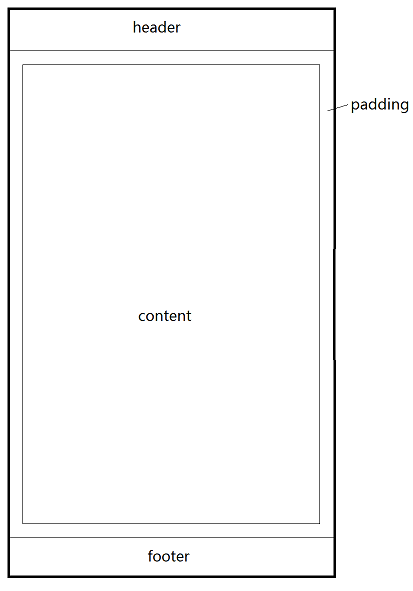

# Page

> Sparrow 2.0

> Inherits: Container

> objectName: "Sparrow.Page 2.0"

页面。

## 属性

+ `data` : `list<QtObject>` **default**

+ `header` : `Item`

+ `content` : `Item` **override** **readonly**

+ `footer` : `Item`

+ `navigation` : `Item` **readonly**

+ `navigationStack` : `Item` **readonly**

+ `navigationSwipe` : `Item` **readonly**

+ `canNavigateBack` : `bool` **readonly**

+ `navigationBarEnabled` : `bool`

## 详细描述

页面，Sparrow 中内容装载和展示的主要单元之一。

> **注意**：不要直接设置 `width` 和 `height`。

## 属性文档

> ### `data` : `list<QtObject>` **default**

默认属性，会将 `data` 中所有的元素设置 `parent`。

> ### `header` : `Item`

页面头部。

> ### `content` : `Item` **override** **readonly**

页面内容部分。

> ### `footer` : `Item`

页面底部。

> ### `navigation` : `Item` **readonly**

页面的导航对象 `Navigation`。

> ### `navigationStack` : `Item` **readonly**

页面的栈管理对象。`NavigationStack`。

> ### `navigationSwipe` : `Item` **readonly**

页面的滑动视图管理。`NavigationSwipe`。

> ### `canNavigateBack` : `bool` **readonly**

能否通过按钮返回上一个页面。

> ### `navigationBarEnabled` : `bool`

当本页面变成当前用户可见时，是否显示导航条。

> **注意**：当 `Page` 内包含 `NavigationSwipe` 或者 `NavigationStack` 时，需要重新设定 `navigationBarEnabled`，将其绑定到 `NavigationSwipe.navigationBarEnabled` 或者 `NavigationStack.navigationBarEnabled`。
